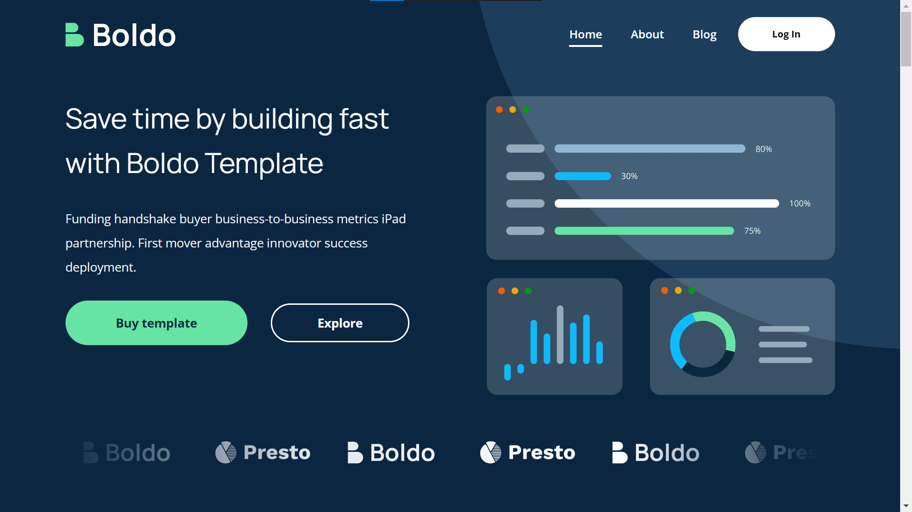

# Boldo Portfolio Project

A responsive, modern, and animated landing page connected to a custom SCSS/CSS file. This project has been refactored for improved interactivity, performance, and mobile experience.

## Features

- **Mobile Responsiveness**: Elements gracefully stack on smaller screens. Padding and margins scale down to preserve the layout aesthetics on all viewports.
- **Nav Item Styling**: Modern hover effects with animated underlines on navigation links.
- **Scroll Animations**: Lightweight IntersectionObserver triggers `.fade-up` and `.slide-in` animations as elements scroll into view.
- **Performance Optimized**: Images below the hero section are optimized with `loading="lazy"` and `decoding="async"` for a faster initial page load.

Project Screenshot

## Project Structure

- `index.html` - The main entry point (fully optimized with lazy loading attributes and animation classes).
- `scss/` - Contains the modular styling rules.
  - `main.scss` - Main stylesheet containing typography, animation classes, and hover effects.
  - `_media.scss` - Contains mobile responsiveness logic.
- `app.js` - Contains the logic for toggling the mobile menu and the `IntersectionObserver` for scroll animations.
- `img/` - Contains graphics and visual assets.

## Running Locally

To view the project, simply open `index.html` in your web browser. 
If you modify the SCSS files, make sure to compile them to CSS using a tool like the Live Sass Compiler extension or via command line.
